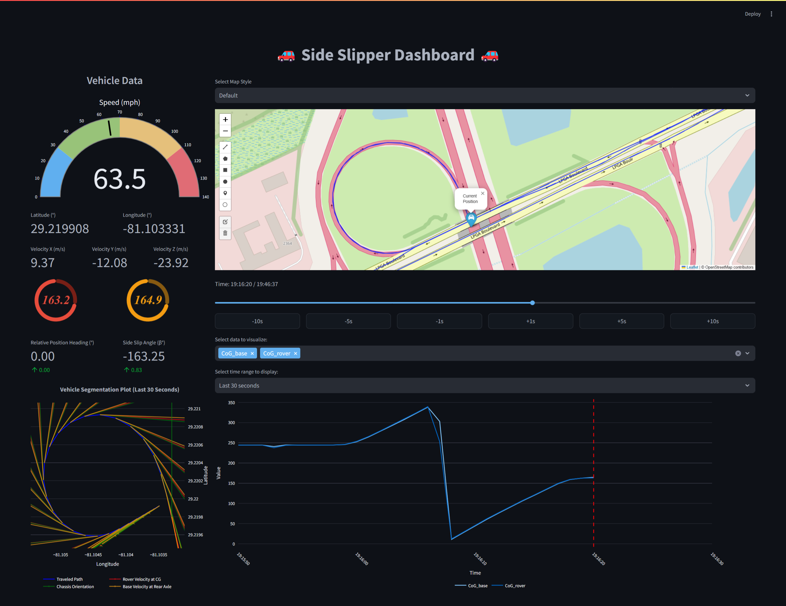

<div align="center">
  <h1 align="center">Vehicle Side Slip Dashboard</h1>
</div>

This project is a web application built with Streamlit that visualizes vehicle dynamics, specifically focusing on side slip data. It provides interactive controls and visualizations to help users understand vehicle behavior under various conditions.

<div align="center">
  
</div>

## Setup Instructions

Follow these steps to set up the project environment after you have cloned this repo:

1. **Create a new conda environment:**
   ```bash
   conda create -n tmp python=3.10 -y
   ```

2. **Activate the conda environment:**
   ```bash
   conda activate tmp
   ```

3. **Install `uv` first:**
   ```bash
   pip install uv
   ```

4. **Install the required packages:**
   ```bash
   uv pip install -r requirements.txt
   ```

5. **Run the Streamlit application:**
   ```bash
   streamlit run src/app.py
   ```

## Development Instructions

1. **Code Linting and Formatting:**
   ```bash
   ruff check
   ruff format
   ```


## Notes
- Ensure you have `conda` installed (if not, you may install it via [miniforge](https://github.com/conda-forge/miniforge)).